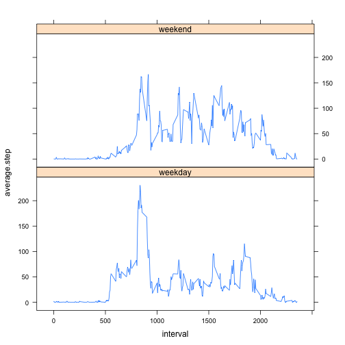

# Peer Assesment 1 - Knitr
Xiao Yang

### Loading and preprocessing the data

First set up a few options.

```r
library(knitr)
opts_chunk$set(echo=TRUE, results="hide", cache=TRUE)
```

Then get the data.

```r
setwd("~")
setwd("desktop/coursera/RepData_PeerAssessment1")
rawdata <- read.csv("activity.csv", header = T)
```

### What is the mean total number of steps taken per day?

After getting the data, we will get the mean total number of steps taken per day. 
First we make a histogram of the total number of steps taken each day.

```r
stepSum <- with(rawdata, tapply(steps, date, sum))
totalStep <- data.frame(stepSum, Date = rownames(stepSum), row.names = NULL)
with(totalStep, hist(stepSum, xlab = "Total Steps Taken Per Day", main = NULL, breaks=10))
```


Then we calculate and report the mean and median total number of steps taken per day. 

```r
library(rpart)
options(digits=7, scipen=1)
stepSummary <- summary(totalStep$stepSum)
getmean <- stepSummary[[4]]; getmedian <- stepSummary[[3]]
```
The mean total number of steps taken per day is 10770.
The median total number of steps taken per day is 10760.

### What is the average daily activity pattern?
We make a time series plot with the 5-minute interval and the average number of steps taken in the interval across all days.

```r
## Get a list of means
avstep <- with(rawdata, tapply(steps, interval, mean, na.rm = T))
## Transfer the list into a dataframe so we can make plots
avstepdata <- data.frame(avstep, Interval = rownames(avstep), row.names=NULL)
avstepdata$Interval <- as.character(avstepdata$Interval)
with(avstepdata, plot(Interval, avstep, type="l", ylab = "Average Steps"))
```


From the plot we can see that the interval that contains the most steps is somewhere near 9 o'clock. To confirm that, we do the following calculation.

```r
maxinterval <- avstepdata[which.max(avstepdata$avstep), 2]
```
The 835 interval, on average across all the days in the dataset, contains the maximum number of steps.

### Imputing missing values

```r
NAs <- sum(is.na(rawdata$steps))
## find out which rows have NA values
NArow <- which(is.na(rawdata$steps))
## create a for loop to fill in the NA value one by one, with the mean number of steps from that missing interval
filldata <- rawdata
for (i in NArow) {
        filldata[i,1] <- avstepdata[which(avstepdata$Interval==filldata[i,3]), 1]
}
```
This new dataset has all of its missing values filled with the mean of that 5-minute interval. Now we get the mean and median like we did before. 

First we get a histogram of the new filldata

```r
stepSum1 <- with(filldata, tapply(steps, date, sum))
totalStep1 <- data.frame(stepSum1, Date = rownames(stepSum1), row.names = NULL)
with(totalStep1, hist(stepSum1, xlab = "Total Steps Taken Per Day", main = NULL, breaks=10))
```


Then we calculate and report the new mean and median total number of steps taken per day. 

```r
library(rpart)
options(digits=7, scipen=1)
stepSummary1 <- summary(totalStep1$stepSum1)
stepSummary
stepSummary1
getmean1 <- stepSummary1[[4]]; getmedian1 <- stepSummary1[[3]]
```
The new mean total number of steps taken per day is 10770.
The new median total number of steps taken per day is 10770.

### Are there differences in activity patterns between weekdays and weekends?

```r
filldata$date <- as.Date(filldata$date)
filldata$day <- NA
for (i in 1:nrow(filldata)) {
        if (weekdays(filldata[i,2]) %in% c("Saturday", "Sunday")) {
                filldata[i,4] = "weekend"
        } else {
                filldata[i,4] = "weekday"
        }
}

diffday <- data.frame(with(filldata, tapply(steps, list(interval, day), mean)))
library(reshape2)
diffday$interval <- rownames(diffday)
meltday <- melt(diffday, id=c("interval"), measure.var = c("weekday", "weekend"))
names(meltday) <- c("interval", "day", "average.step")
meltday$interval <- as.integer(meltday$interval)
library(lattice)
xyplot(average.step ~ interval | day, data = meltday, type = "l", layout = c(1,2))
```



